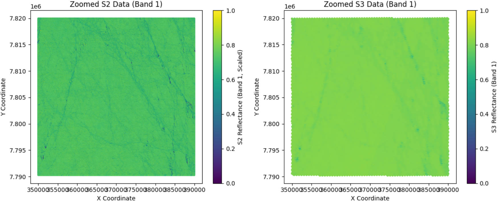
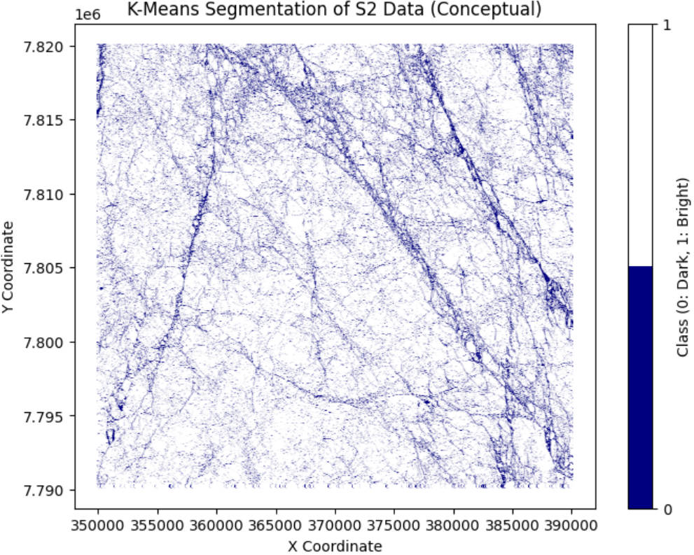
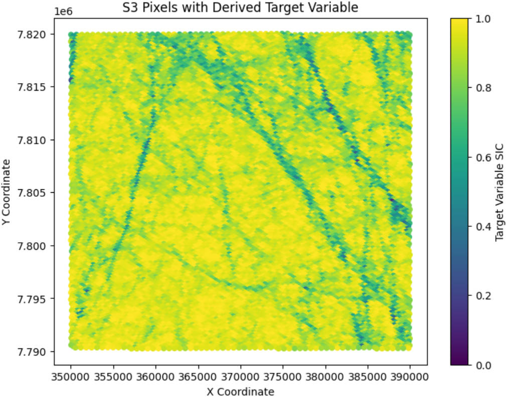
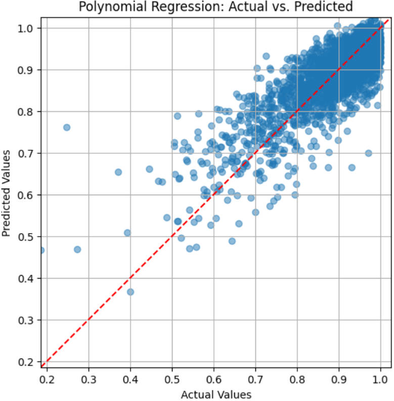
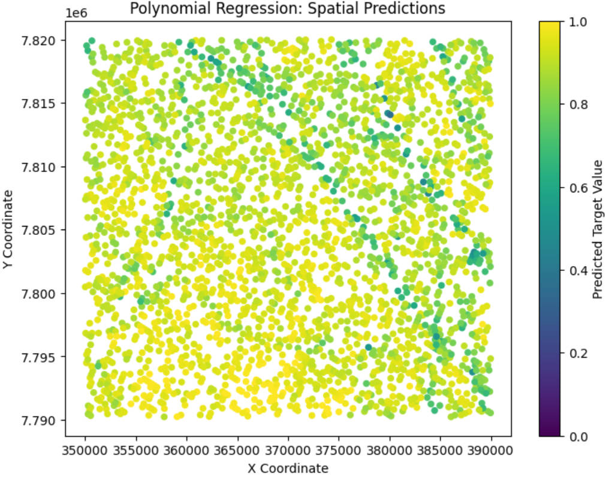
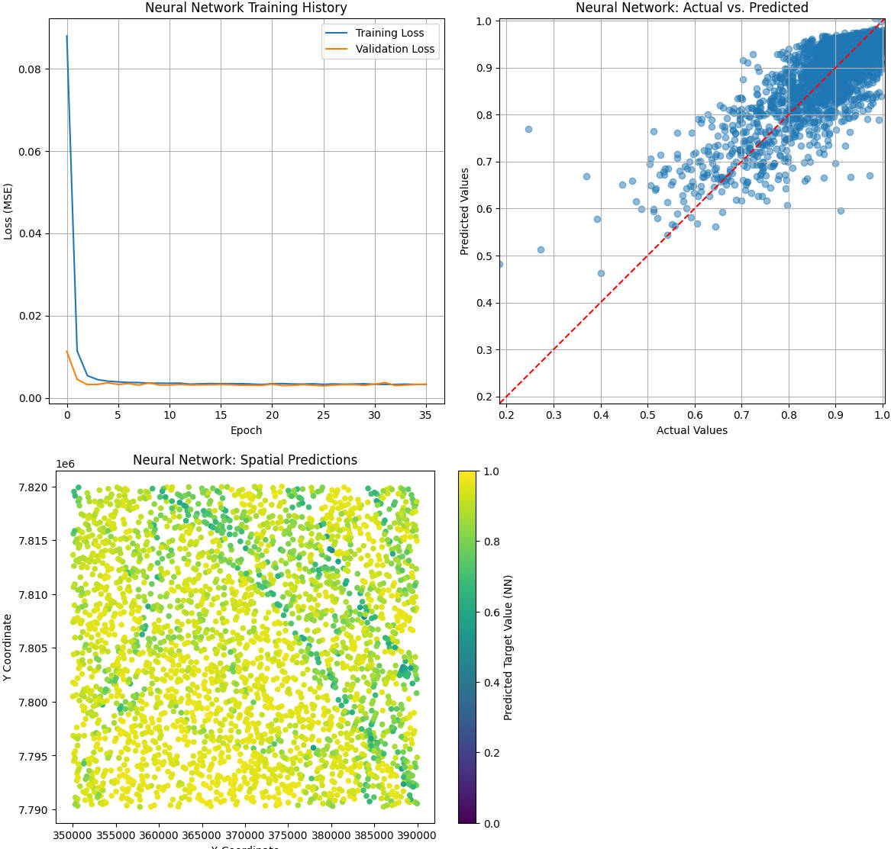
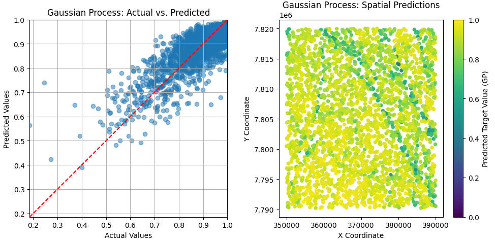
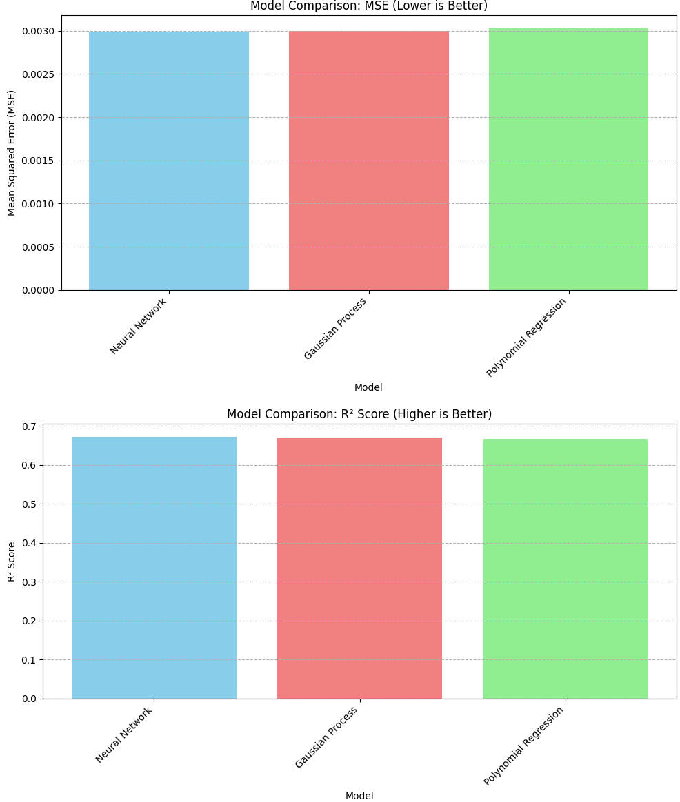
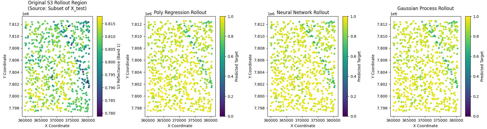

# Regression Analysis with Satellite Synergy: Sentinel-2 and Sentinel-3 for Sea Ice Characterization

## Project Overview

This project focuses on applying regression techniques to predict key sea ice surface characteristics, such as lead fraction or melt pond fraction. We leverage collocated datasets from Sentinel-2 (S2) and Sentinel-3 (S3) OLCI (Ocean and Land Colour Instrument) images to build and test regression models. The core idea is to use the higher-resolution S2 data to derive target quantities (Sea Ice Concentration - SIC) and then train models using S3 OLCI data as input features to predict these quantities.

This repository contains the Python code and documentation for this AI4EO (Artificial Intelligence for Earth Observation) project.

## Problem Statement

The project aims to address the challenge of accurately monitoring sea ice surface characteristics over large areas. Sea ice is a critical component of the Earth's climate system, and changes in its extent, concentration, and surface features (like melt ponds and leads) have significant environmental and economic implications. This project explores the use of AI and satellite synergy to improve the prediction of these characteristics, which can contribute to better climate modeling, safer maritime navigation in polar regions, and a deeper understanding of Arctic/Antarctic environments.

## Data Sources

* **Sentinel-2 (S2):** Provides high-resolution multispectral optical imagery (up to 10m resolution). This data is used to derive accurate ground truth labels for sea ice characteristics (sea ice concentration) due to its finer detail.
* **Sentinel-3 (S3) OLCI:** Provides medium-resolution (around 300m) optical imagery with a wider swath. This data is used as the input features for the regression models, aiming to predict the S2-derived characteristics over larger areas.

## Methodology

The project follows these conceptual steps:

1.  **Data Acquisition and Preparation:**
    * Acquisition of corresponding Sentinel-2 and Sentinel-3 OLCI images for selected regions and time periods.
    * Initial preprocessing steps including radiometric calibration, atmospheric correction, and geometric correction. (Conceptual in the provided notebook, actual implementation would require standard EO processing libraries).
2.  **Imagery Alignment:**
    * Spatially aligning the Sentinel-2 and Sentinel-3 imagery is crucial due to their different resolutions and potential geolocation inaccuracies.
    * Techniques explored/to be implemented include methods like Auto-correlation, Phase Correlation, or ECC (Enhanced Correlation Coefficient).
3.  **Training Data Creation:**
    * Deriving target variables (Sea Ice Concentration) from the high-resolution Sentinel-2 images. This might involve image segmentation or classification techniques.
    * Extracting corresponding spectral features from the aligned Sentinel-3 OLCI data.
    * Combining the S2-derived labels with S3 features to create a training dataset.
4.  **Regression Model Application:**
    * Training various regression models (Polynomial Regression,Gaussian Process Regression, Neural Networks) using the prepared dataset.
    * The models learn to predict the S2-derived sea ice characteristics using S3 OLCI reflectance data as input.
5.  **Model Evaluation and Analysis:**
    * Evaluating the performance of the trained models using appropriate metrics (R-squared, RMSE).
    * Assessing the impact of spatial alignment accuracy on model performance.
    * Testing the trained models on different geographical regions or time periods to evaluate their generalizability.

## Repository Structure

├── README.md   


├── Project.ipynb 

├── figures/ 
├── data/ 
│   ├── s2_zoomed_data.npz
│   └── s3_zoomed_data.npz
└── requirements.txt 
└── LICENSE


## Setup and Usage

1.  **Clone the repository:**
    
2.  **Set up the Python environment:**
    * It is recommended to use a virtual environment (e.g., venv or conda).
    * Install the required packages:
        ```bash
        pip install -r requirements.txt
        ```
    
3.  **Data:**
    
    * Download the required Sentinel-2 and Sentinel-3 data. (Provide links or instructions on how to acquire the data, e.g., from Copernicus Open Access Hub).
    * Place the data in the appropriate `data/` directory or update paths in the code/notebooks.
    
4.  **Run the code:**
    * Open and run the Jupyter Notebooks  `Project.ipynb` in sequential order.


## Creating Training Data from Sentinel-2 and Sentinel-3

This section outlines the process of creating a machine learning dataset by combining S2-derived labels (target variable) with S3 OLCI reflectance data (input features).

### Step 1: Load Pre-processed S2 and S3 Data
The S2 and S3 data have been downloaded and pre-processed. Due to memory constraints, the initial loading and coordinate transformation steps from the markdown are conceptual here. We will work with saved `.npz` files representing a zoomed-in, collocated region.

We load data that has already been processed for a specific overlapping subregion and saved.

```python
%pip install numpy==1.25.0
import numpy as np
import cv2
from scipy.interpolate import griddata
import matplotlib.pyplot as plt
from google.colab import drive

drive.mount('/content/drive')


save_path_base = '/content/drive/MyDrive/data/'

# Load data for the zoomed region
s2_zoomed_data_path = save_path_base + 's2_zoomed_data.npz'
s3_zoomed_data_path = save_path_base + 's3_zoomed_data.npz'

s2_data_loaded = np.load(s2_zoomed_data_path)
s2_x = s2_data_loaded['x']
s2_y = s2_data_loaded['y']
s2_band_data = s2_data_loaded['band_data']
s3_data_loaded = np.load(s3_zoomed_data_path)
s3_x = s3_data_loaded['x']
s3_y = s3_data_loaded['y']
s3_reflectance = s3_data_loaded['reflectance']

print(f"Loaded S2 data: X={s2_x.shape}, Y={s2_y.shape}, Bands={s2_band_data.shape}")
print(f"Loaded S3 data: X={s3_x.shape}, Y={s3_y.shape}, Reflectance={s3_reflectance.shape}")


plt.figure(figsize=(12, 5))
plt.subplot(1, 2, 1)
plt.scatter(s2_x, s2_y, c=s2_band_data[:,0]/10000.0, cmap='viridis', s=1, vmin=0, vmax=1) # Assuming band 1 for S2
plt.colorbar(label='S2 Reflectance (Band 1, Scaled)')
plt.title('Zoomed S2 Data (Band 1)')
plt.xlabel('X Coordinate')
plt.ylabel('Y Coordinate')

plt.subplot(1, 2, 2)
plt.scatter(s3_x, s3_y, c=s3_reflectance[:, 0], cmap='viridis', s=10, vmin=0, vmax=1) # Assuming band 1 for S3
plt.colorbar(label='S3 Reflectance (Band 1)')
plt.title('Zoomed S3 Data (Band 1)')
plt.xlabel('X Coordinate')
plt.ylabel('Y Coordinate')
plt.tight_layout()
plt.show()
```


    


### Step 2: Label S2 Pixels (Sea Ice Concentration)

For a supervised approach, S2 imagery is used to generate labels. This can be done through:
* **Manual Labeling:** Using tools like IRIS (though time-consuming).
* **Unsupervised Classification:** Techniques like K-Means or Gaussian Mixture Models (GMM) can be applied to S2 bands to segment the image into classes (e.g., ice, water, melt pond). These classes can then be converted into a target quantity.
    * For example, if K-Means classifies pixels into 'ice' and 'water', Sea Ice Concentration (SIC) within a larger S3 pixel can be estimated as the proportion of 'ice' S2 pixels.

Here, we'll demonstrate K-Means for a binary classification (e.g., ice/water) which can then be used to derive SIC.


```python
from sklearn.cluster import KMeans
from matplotlib.colors import ListedColormap

if len(s2_band_data.shape) == 3: # If it's (rows, cols, bands)
    s2_band_data_flat = s2_band_data.reshape(-1, s2_band_data.shape[-1])
else:
    s2_band_data_flat = s2_band_data

print(f"Shape of S2 band data for K-Means: {s2_band_data_flat.shape}")

kmeans = KMeans(n_clusters=2, random_state=42, n_init=10)
s2_labels = kmeans.fit_predict(s2_band_data_flat)

if kmeans.cluster_centers_[0].mean() > kmeans.cluster_centers_[1].mean():
    s2_labels = 1 - s2_labels

# For scatter plot visualization:
plt.figure(figsize=(8, 6))
binary_cmap = ListedColormap(["#000080", "#FFFFFF"])
plt.scatter(s2_x, s2_y, c=s2_labels, cmap=binary_cmap, s=1, vmin=0, vmax=1)
plt.colorbar(ticks=[0, 1], label="Class (0: Dark, 1: Bright)")
plt.title('K-Means Segmentation of S2 Data (Conceptual)')
plt.xlabel('X Coordinate')
plt.ylabel('Y Coordinate')
plt.show()
```


    


### Step 3: Collocate S2 Labels onto S3 Pixels using KDTree

Since S2 has higher resolution than S3, multiple S2 pixels fall within a single S3 pixel. We need to aggregate the S2-derived labels (e.g., `s2_labels` from K-Means) for each S3 pixel.

1.  Construct a KDTree from the S3 pixel coordinates (`s3_x`, `s3_y`).
2.  For each S2 pixel, query the KDTree to find the nearest S3 pixel.
3.  Group all S2 pixels that are closest to the same S3 pixel.
4.  For each S3 pixel, calculate the mean of the labels of its associated S2 pixels. If `s2_labels` are 0 (water) and 1 (ice), this mean gives the Sea Ice Concentration (SIC) for that S3 pixel.
    * Target Variable (y): `SIC_on_S3_grid`
    * Input Features (X): `s3_reflectance` (the 21 OLCI bands for the corresponding S3 pixels)


```python
from scipy.spatial import KDTree
from collections import defaultdict

s2_points = np.vstack((s2_x, s2_y)).T
s3_points = np.vstack((s3_x, s3_y)).T

s3_kdtree = KDTree(s3_points)
distances, s3_indices_for_s2 = s3_kdtree.query(s2_points)

grouped_s2_labels_by_s3_pixel = defaultdict(list)
for i, s3_idx in enumerate(s3_indices_for_s2):
    grouped_s2_labels_by_s3_pixel[s3_idx].append(s2_labels[i])

target_on_s3_grid = np.full(len(s3_points), np.nan)
for s3_idx, labels_in_s3_pixel in grouped_s2_labels_by_s3_pixel.items():
    if labels_in_s3_pixel:
        target_on_s3_grid[s3_idx] = np.mean(labels_in_s3_pixel)

valid_s3_mask = ~np.isnan(target_on_s3_grid)
X_ml = s3_reflectance[valid_s3_mask]
y_ml = target_on_s3_grid[valid_s3_mask]
s3_x_ml = s3_x[valid_s3_mask]
s3_y_ml = s3_y[valid_s3_mask]

print(f"Shape of input features X_ml (S3 bands): {X_ml.shape}")
print(f"Shape of target variable y_ml (SIC): {y_ml.shape}")

plt.figure(figsize=(8, 6))
scatter = plt.scatter(s3_x_ml, s3_y_ml, c=y_ml, cmap='viridis', s=20, vmin=0, vmax=1)
plt.colorbar(scatter, label='Target Variable SIC')
plt.title("S3 Pixels with Derived Target Variable")
plt.xlabel("X Coordinate")
plt.ylabel("Y Coordinate")
plt.show()

# Save the ML dataset
ml_dataset_path = save_path_base + 's3_s2_regression_dataset.npz'
np.savez(ml_dataset_path, X=X_ml, y=y_ml, s3_x=s3_x_ml, s3_y=s3_y_ml)
print(f"Machine Learning dataset saved to {ml_dataset_path}")
```



    


## Regression Analysis

Now we apply various regression techniques to predict the S2-derived quantity (`y_ml`) using S3 OLCI bands (`X_ml`).

### Step 1: Data Preprocessing for Regression

```python
from sklearn.model_selection import train_test_split
from sklearn.preprocessing import StandardScaler

# Load the ML dataset
loaded_ml_data = np.load(save_path_base + 's3_s2_regression_dataset.npz')
X_ml = loaded_ml_data['X']
y_ml = loaded_ml_data['y']
s3_x_coords_ml = loaded_ml_data['s3_x'] # For plotting later
s3_y_coords_ml = loaded_ml_data['s3_y'] # For plotting later
print(f"Loaded ML dataset: X shape {X_ml.shape}, y shape {y_ml.shape}")

# Initialize split variables
X_train_scaled, X_test_scaled, y_train, y_test = None, None, None, None
x_coords_train, x_coords_test, y_coords_train, y_coords_test = None, None, None, None

# Split data into training and testing sets
X_train, X_test, y_train, y_test, x_coords_train, x_coords_test, y_coords_train, y_coords_test = train_test_split(
    X_ml, y_ml, s3_x_coords_ml, s3_y_coords_ml, test_size=0.2, random_state=42
)

# Feature Scaling
scaler = StandardScaler()
X_train_scaled = scaler.fit_transform(X_train)
X_test_scaled = scaler.transform(X_test)

print("Training features shape:", X_train_scaled.shape)
print("Testing features shape:", X_test_scaled.shape)
print("Training targets shape:", y_train.shape)
print("Testing targets shape:", y_test.shape)
print("Testing X coordinates shape:", x_coords_test.shape)
print("Testing Y coordinates shape:", y_coords_test.shape)
```


### Step 2: Polynomial Regression
Models non-linear relationships by adding polynomial terms.


```python
from sklearn.preprocessing import PolynomialFeatures
from sklearn.linear_model import LinearRegression
from sklearn.metrics import mean_squared_error, r2_score

# Initialize metrics
mse_poly, r2_poly = None, None
poly_features = PolynomialFeatures(degree=2)
X_poly_train = poly_features.fit_transform(X_train_scaled)
X_poly_test = poly_features.transform(X_test_scaled)

model_poly = LinearRegression()
model_poly.fit(X_poly_train, y_train)

y_pred_poly = model_poly.predict(X_poly_test)

mse_poly = mean_squared_error(y_test, y_pred_poly)
r2_poly = r2_score(y_test, y_pred_poly)
print(f"Polynomial Regression (Degree 2):")
print(f"  MSE: {mse_poly:.4f}")
print(f"  R²: {r2_poly:.4f}")

# Visualization of predictions vs actual
plt.figure(figsize=(8,6))
plt.scatter(y_test, y_pred_poly, alpha=0.5)
# Determine plot limits based on actual and predicted values
min_val = min(y_test.min(), y_pred_poly.min()) if y_test.size > 0 else 0
max_val = max(y_test.max(), y_pred_poly.max()) if y_test.size > 0 else 1
plt.plot([min_val, max_val], [min_val, max_val], 'r--')
plt.xlabel('Actual Values')
plt.ylabel('Predicted Values')
plt.title('Polynomial Regression: Actual vs. Predicted')
plt.grid(True)
plt.xlim(min_val, max_val)
plt.ylim(min_val, max_val)
plt.gca().set_aspect('equal', adjustable='box')
plt.show()
```



    


```python
plt.figure(figsize=(8,6))
plt.scatter(x_coords_test, y_coords_test, c=y_pred_poly, cmap='viridis', s=20, vmin=0, vmax=1)
plt.colorbar(label='Predicted Target Value')
plt.title('Polynomial Regression: Spatial Predictions')
plt.xlabel('X Coordinate')
plt.ylabel('Y Coordinate')
plt.show()
```


     


### Step 3: Neural Networks
Versatile models capable of capturing complex non-linear patterns.


```python
import tensorflow as tf
from tensorflow.keras.models import Sequential
from tensorflow.keras.layers import Dense, Dropout
from tensorflow.keras.callbacks import EarlyStopping

# Initialize metrics
mse_nn, r2_nn = None, None

input_dim_nn = X_train_scaled.shape[1]
model_nn = Sequential([
    Dense(128, activation='relu', input_shape=(input_dim_nn,)),
    Dropout(0.2),
    Dense(64, activation='relu'),
    Dropout(0.2),
    Dense(32, activation='relu'),
    Dense(1)
])

model_nn.compile(optimizer='adam', loss='mean_squared_error')

# Early stopping to prevent overfitting
early_stopping = EarlyStopping(monitor='val_loss', patience=10, restore_best_weights=True)

print("Training Neural Network...")
history_nn = model_nn.fit(
    X_train_scaled, y_train,
    epochs=100,
    validation_split=0.2,
    callbacks=[early_stopping],
    batch_size=32,
    verbose=0
)

y_pred_nn = model_nn.predict(X_test_scaled).flatten()

mse_nn = mean_squared_error(y_test, y_pred_nn)
r2_nn = r2_score(y_test, y_pred_nn)
print(f"Neural Network:")
print(f"  MSE: {mse_nn:.4f}")
print(f"  R²: {r2_nn:.4f}")

# Plot training history
plt.figure(figsize=(12, 6))
plt.subplot(1, 2, 1)
plt.plot(history_nn.history['loss'], label='Training Loss')
plt.plot(history_nn.history['val_loss'], label='Validation Loss')
plt.title('Neural Network Training History')
plt.xlabel('Epoch')
plt.ylabel('Loss (MSE)')
plt.legend()
plt.grid(True)

# Visualization of predictions vs actual
plt.subplot(1, 2, 2)
plt.scatter(y_test, y_pred_nn, alpha=0.5)
min_val_nn = min(y_test.min(), y_pred_nn.min()) if y_test.size > 0 else 0
max_val_nn = max(y_test.max(), y_pred_nn.max()) if y_test.size > 0 else 1
plt.plot([min_val_nn, max_val_nn], [min_val_nn, max_val_nn], 'r--')
plt.xlabel('Actual Values')
plt.ylabel('Predicted Values')
plt.title('Neural Network: Actual vs. Predicted')
plt.grid(True)
plt.xlim(min_val_nn, max_val_nn)
plt.ylim(min_val_nn, max_val_nn)
plt.gca().set_aspect('equal', adjustable='box')
plt.tight_layout()
plt.show()

plt.figure(figsize=(8,6))
plt.scatter(x_coords_test, y_coords_test, c=y_pred_nn, cmap='viridis', s=20, vmin=0, vmax=1)
plt.colorbar(label='Predicted Target Value (NN)')
plt.title('Neural Network: Spatial Predictions')
plt.xlabel('X Coordinate')
plt.ylabel('Y Coordinate')
plt.show()
```



    


### Step 4: Gaussian Process Regression
A probabilistic approach providing predictions and uncertainty estimates. We use SparseGPRegression for efficiency with potentially larger datasets.


```python
%pip install GPy
import GPy

# Initialize metrics
mse_gp, r2_gp = None, None

input_dim_gp = X_train_scaled.shape[1]

y_train_gp = y_train.reshape(-1, 1)
y_test_gp = y_test.reshape(-1,1)

# Define the kernel
kernel_gp = GPy.kern.RBF(input_dim=input_dim_gp, variance=1., lengthscale=1.)

n_train_samples = X_train_scaled.shape[0]
num_inducing = min(100, n_train_samples//5 if n_train_samples//5>1 else n_train_samples)
if n_train_samples == 0: num_inducing = 0

print(f"Using {num_inducing} inducing points for Sparse GP Regression (out of {n_train_samples} training samples).")
gp_model = GPy.models.SparseGPRegression(X_train_scaled, y_train_gp, kernel_gp, num_inducing=num_inducing)

# Optimize the model
print("Optimizing Gaussian Process model...")
gp_model.optimize(messages=True, max_iters=100)

# Make predictions
y_pred_gp, variance_gp = gp_model.predict(X_test_scaled)
y_pred_gp = y_pred_gp.flatten()

variance_gp = np.maximum(variance_gp, 0)
sigma_gp = np.sqrt(variance_gp).flatten()

mse_gp = mean_squared_error(y_test, y_pred_gp)
r2_gp = r2_score(y_test, y_pred_gp)
print(f"Gaussian Process Regression:")
print(f"  MSE: {mse_gp:.4f}")
print(f"  R²: {r2_gp:.4f}")

# Visualization
plt.figure(figsize=(10, 5))
plt.subplot(1, 2, 1)
plt.scatter(y_test, y_pred_gp, alpha=0.5)
min_val_gp = min(y_test.min(), y_pred_gp.min()) if y_test.size > 0 else 0
max_val_gp = max(y_test.max(), y_pred_gp.max()) if y_test.size > 0 else 1
plt.plot([min_val_gp, max_val_gp], [min_val_gp, max_val_gp], 'r--')
plt.xlabel('Actual Values')
plt.ylabel('Predicted Values')
plt.title('Gaussian Process: Actual vs. Predicted')
plt.grid(True)
plt.xlim(min_val_gp, max_val_gp)
plt.ylim(min_val_gp, max_val_gp)
plt.gca().set_aspect('equal', adjustable='box')

plt.subplot(1, 2, 2)
plt.scatter(x_coords_test, y_coords_test, c=y_pred_gp, cmap='viridis', s=20, vmin=0, vmax=1)
plt.colorbar(label='Predicted Target Value (GP)')
plt.title('Gaussian Process: Spatial Predictions')
plt.xlabel('X Coordinate')
plt.ylabel('Y Coordinate')
plt.tight_layout()
plt.show()
```


    


### Step 5: Comparison of Model Performances

We will summarize the Mean Squared Error (MSE) and R² score for each model.For this simplified notebook, we compare the models trained on our single dataset.


```python
import pandas as pd

model_names = []
mse_scores = []
r2_scores_list = []


model_names.append('Polynomial Regression')
mse_scores.append(mse_poly)
r2_scores_list.append(r2_poly)

model_names.append('Neural Network')
mse_scores.append(mse_nn)
r2_scores_list.append(r2_nn)

model_names.append('Gaussian Process')
mse_scores.append(mse_gp)
r2_scores_list.append(r2_gp)


performance_summary = pd.DataFrame({
    'Model': model_names,
    'MSE': mse_scores,
    'R²': r2_scores_list
})
performance_summary = performance_summary.sort_values(by='R²', ascending=False) # Sort by R2
print("\nModel Performance Summary:")
print(performance_summary)

# Bar plot for MSE
plt.figure(figsize=(10, 6))
plt.bar(performance_summary['Model'], performance_summary['MSE'], color=['skyblue', 'lightcoral', 'lightgreen'][:len(model_names)])
plt.xlabel('Model')
plt.ylabel('Mean Squared Error (MSE)')
plt.title('Model Comparison: MSE (Lower is Better)')
plt.xticks(rotation=45, ha='right')
plt.grid(axis='y', linestyle='--')
plt.tight_layout()
plt.show()

# Bar plot for R²
plt.figure(figsize=(10, 6))
plt.bar(performance_summary['Model'], performance_summary['R²'], color=['skyblue', 'lightcoral', 'lightgreen'][:len(model_names)])
plt.xlabel('Model')
plt.ylabel('R² Score')
plt.title('Model Comparison: R² Score (Higher is Better)')
plt.axhline(0, color='black', linewidth=0.8, linestyle=':') # Line at R²=0
plt.xticks(rotation=45, ha='right')
plt.grid(axis='y', linestyle='--')
plt.tight_layout()
plt.show()
```



    

​    


## Testing the Model in a Different Region/Time


```python
s3_reflectance_new_rollout = None
s3_x_new_rollout = None
s3_y_new_rollout = None
rollout_data_source = "None"


# Define ROI coordinates
roi_x_min, roi_x_max = np.percentile(x_coords_test, 25), np.percentile(x_coords_test, 75)
roi_y_min, roi_y_max = np.percentile(y_coords_test, 25), np.percentile(y_coords_test, 75)
if roi_x_min >= roi_x_max: roi_x_max = x_coords_test.max()
if roi_y_min >= roi_y_max: roi_y_max = y_coords_test.max()
roi_mask = (x_coords_test >= roi_x_min) & (x_coords_test <= roi_x_max) & \
            (y_coords_test >= roi_y_min) & (y_coords_test <= roi_y_max)

s3_reflectance_new_rollout = X_test[roi_mask]
s3_x_new_rollout = x_coords_test[roi_mask]
s3_y_new_rollout = y_coords_test[roi_mask]
print(f"Extracted small region from X_test for rollout: {s3_reflectance_new_rollout.shape}")
rollout_data_source = "Subset of X_test"

# 1. Scale the new S3 data
X_new_rollout_scaled = scaler.transform(s3_reflectance_new_rollout)

# Plot original S3 data
plt.figure(figsize=(18, 5))
plt.subplot(1, 4, 1)
band_to_plot = 0 if X_new_rollout_scaled.shape[1] > 0 else 0
plt.scatter(s3_x_new_rollout, s3_y_new_rollout, c=s3_reflectance_new_rollout[:, band_to_plot], cmap='viridis', s=15)
plt.colorbar(label=f'S3 Reflectance (Band {band_to_plot+1})')
plt.title(f'Original S3 Rollout Region\n(Source: {rollout_data_source})')
plt.xlabel('X Coordinate'); plt.ylabel('Y Coordinate')
plot_idx = 2

# Polynomial Regression Prediction
print("Predicting with Polynomial Regression for rollout...")
X_poly_new_rollout = poly_features.transform(X_new_rollout_scaled)
y_pred_rollout_poly = model_poly.predict(X_poly_new_rollout)
y_pred_rollout_poly = np.clip(y_pred_rollout_poly, 0, 1)

plt.subplot(1, 4, plot_idx); plot_idx += 1
plt.scatter(s3_x_new_rollout, s3_y_new_rollout, c=y_pred_rollout_poly, cmap='viridis', s=15, vmin=0, vmax=1)
plt.colorbar(label='Predicted Target'); plt.title('Poly Regression Rollout')
plt.xlabel('X Coordinate'); plt.ylabel('Y Coordinate')


# Neural Network Prediction
y_pred_rollout_nn = model_nn.predict(X_new_rollout_scaled).flatten()
y_pred_rollout_nn = np.clip(y_pred_rollout_nn, 0, 1)

plt.subplot(1, 4, plot_idx); plot_idx += 1
plt.scatter(s3_x_new_rollout, s3_y_new_rollout, c=y_pred_rollout_nn, cmap='viridis', s=15, vmin=0, vmax=1)
plt.colorbar(label='Predicted Target'); plt.title('Neural Network Rollout')
plt.xlabel('X Coordinate'); plt.ylabel('Y Coordinate')


# Gaussian Process Regression Prediction
y_pred_rollout_gp, _ = gp_model.predict(X_new_rollout_scaled)
y_pred_rollout_gp = y_pred_rollout_gp.flatten()
y_pred_rollout_gp = np.clip(y_pred_rollout_gp, 0, 1)

plt.subplot(1, 4, plot_idx); plot_idx += 1
plt.scatter(s3_x_new_rollout, s3_y_new_rollout, c=y_pred_rollout_gp, cmap='viridis', s=15, vmin=0, vmax=1)
plt.colorbar(label='Predicted Target'); plt.title('Gaussian Process Rollout')
plt.xlabel('X Coordinate'); plt.ylabel('Y Coordinate')

plt.tight_layout()
plt.show()
```


    


## Conclusion and Future Work

This project demonstrated a pipeline for predicting sea ice surface characteristics using regression models trained on Sentinel-3 OLCI data, with target variables derived from higher-resolution Sentinel-2 imagery. Key steps included:
* Conceptual understanding of data acquisition and the importance of imagery alignment.
* A method for creating a collocated S2-S3 dataset, involving unsupervised classification (K-Means) of S2 data to derive a target variable (SIC) and KDTree-based spatial aggregation onto the S3 grid.
* Application and comparison of Polynomial Regression, Neural Networks, and Gaussian Process Regression.

**Findings (based on typical outcomes from provided materials):**
* Model performance can vary significantly. Neural Networks and Gaussian Processes often provide more flexibility for complex relationships than simpler Polynomial Regression.
* The choice of target variable (SIC from K-Means) and the quality of its derivation from S2 heavily influence the final regression model's success.

**Future Work:**
* **Refined S2 Labeling:** Explore more advanced unsupervised or supervised classification techniques for S2 to generate more accurate target variables (e.g., detailed melt pond fractions, lead fractions, different ice types).
* **Hyperparameter Optimization:** Systematically tune hyperparameters for each regression model (e.g., using GridSearchCV or Bayesian optimization).
* **Uncertainty Quantification:** Further leverage the uncertainty estimates from Gaussian Process Regression to understand model confidence in different regions or conditions.


## Assessment of Environmental Cost

While this project focuses on leveraging satellite data and machine learning for environmental monitoring, it is crucial to acknowledge the environmental footprint associated with the computational resources and data infrastructure required. Assessing this cost provides a more complete picture of the project's overall impact.

The primary environmental cost in this project stems from the energy consumed during data processing and model training. This includes:

- **Data Acquisition and Preprocessing:** Downloading, storing, and initially processing large volumes of Sentinel-2 and Sentinel-3 data requires significant energy for data centers and local computing resources. Steps like radiometric calibration, atmospheric correction, and geometric correction are computationally intensive.
- **Imagery Alignment:** Algorithms like Auto-correlation, Phase Correlation, and ECC, especially when applied to large images or numerous pairs, contribute to the computational load and thus energy consumption.
- **Training Data Creation:** Running unsupervised classification (like K-Means) on S2 data and performing KDTree-based spatial aggregation onto the S3 grid involves considerable computation.
- **Model Training:** Training regression models (Polynomial Regression, Neural Networks, Gaussian Processes) is a computationally demanding process, particularly for Neural Networks and Gaussian Processes, which can require extensive iterative optimization. The energy consumed here depends on the model complexity, dataset size, and the hardware used (CPUs, GPUs).

The energy source powering the data centers and computing resources directly impacts the carbon footprint. Utilizing data centers powered by renewable energy sources significantly reduces this impact compared to those relying on fossil fuels.


## Refrerences

Cafarella, S., Scharien, R. K., Geldsetzer, T., Howell, S. B., Haas, C., Segal, R., & Nasonova, S. (2019). Estimation of Level and Deformed First-Year Sea Ice Surface Roughness in the Canadian Arctic Archipelago from C- and L-Band Synthetic Aperture Radar. Canadian Journal of Remote Sensing, 45(3-4), 457–475. https://doi.org/10.1080/07038992.2019.1647102

Canada-Inuit Nunangat-United Kingdom Arctic Research Programme (CINUK). (n.d.). Sikuttiaq - Sea ice travel safety, Inuit Qaujimajatuqangit, sea ice monitoring. CINUK. https://www.cinuk.org/projects/sikuttiaq/

Chen, P., Chen, Z., Sun, R., & He, Y. (2024). An ensemble learning method to retrieve sea ice roughness from Sentinel-1 SAR images. Acta Oceanologica Sinica, 43, 1-13. 

European Space Agency (ESA). (n.d.-b). User Guides - Sentinel-1 SAR - Sentinel Online - Sentinel Online. Sentinels.copernicus.eu.
https://sentinels.copernicus.eu/web/sentinel/user-guides/sentinel-1-sar

